# BlendendPlaygroundPhx

A web UI for experimenting with [`blendend`](https://github.com/narslan/blendend): 
Safety: the backend evaluates the code you type. Run it only on a trusted machine.

## Features
- **Playground** – live sketchbook for `blendend` snippets. 
- **Swatches** – palette browser rendered as collages. It shows how colors interact on a composition.
- **Font Manager** – lists scanned fonts and renders a Blendend-powered preview. Supports unicode escapes (e.g. `\\u{1301C}`), size, and color controls.

## Visual Overview

### Swatches & Font Manager

| Page | Preview |
| --- | --- |
| Swatches | 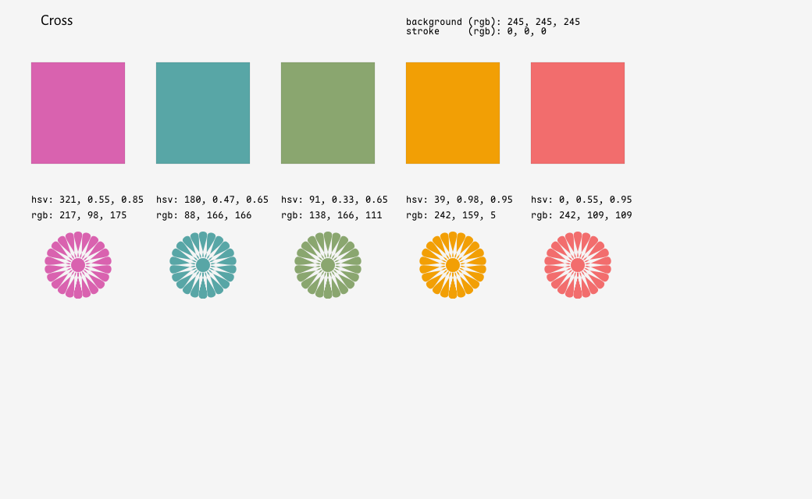 |
| Font Manager | 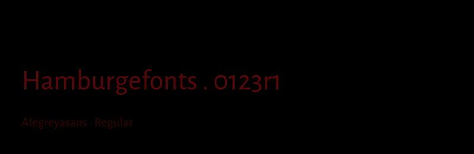 |

### Playground Demos

| Axis histogram trees | Axis playground | Burn grid |
| --- | --- | --- |
| 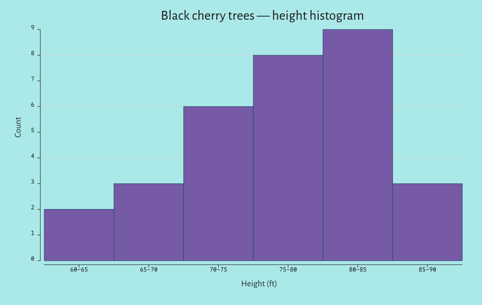 | 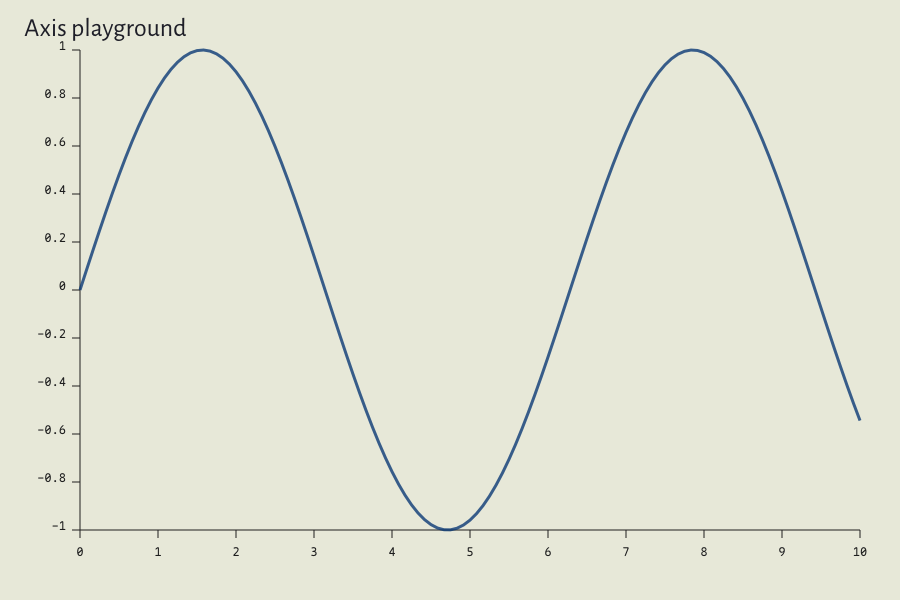 | 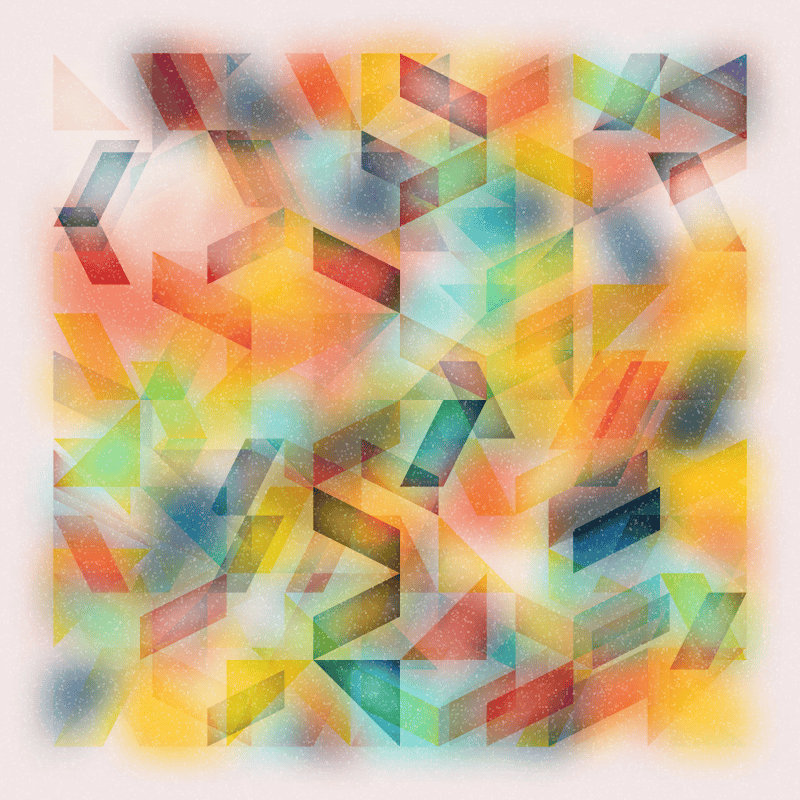 |

| Circle of fifths | Curtains | Daisy field |
| --- | --- | --- |
| 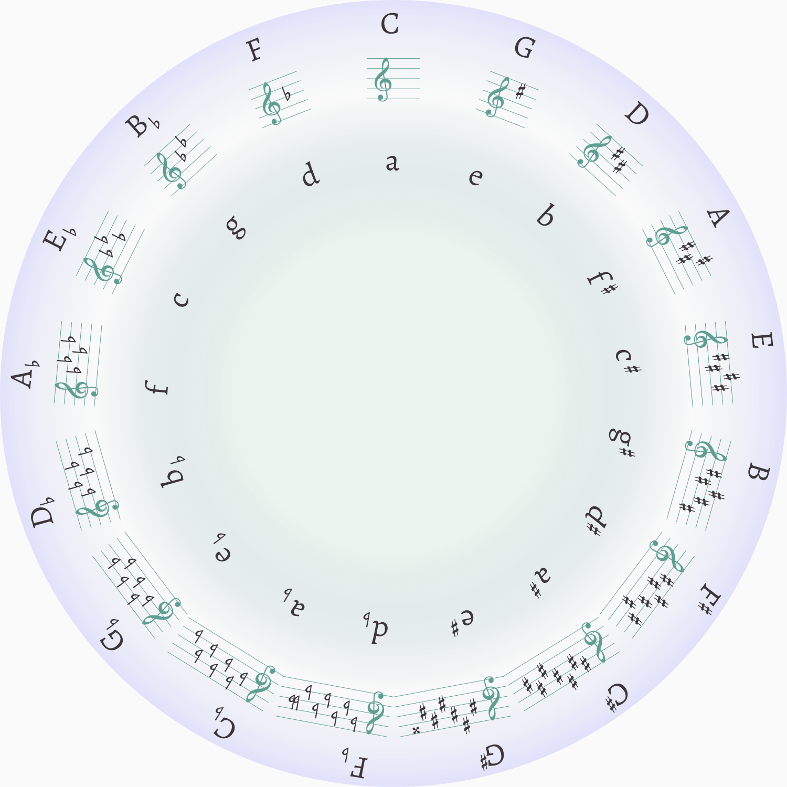 | 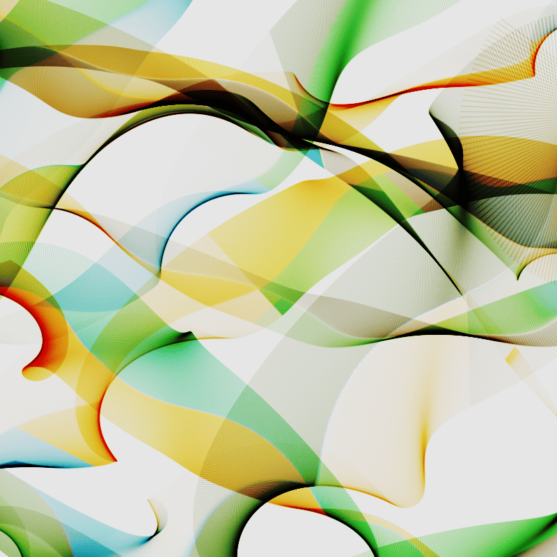 | 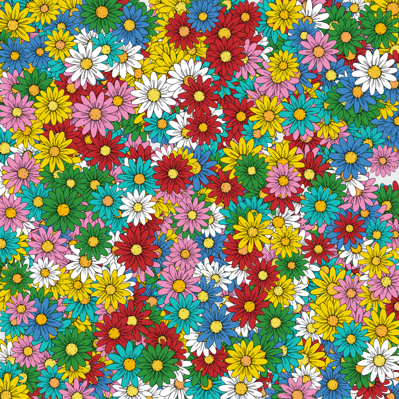 |

| Floral wave | Font tiles | Font tiles 2 |
| --- | --- | --- |
| 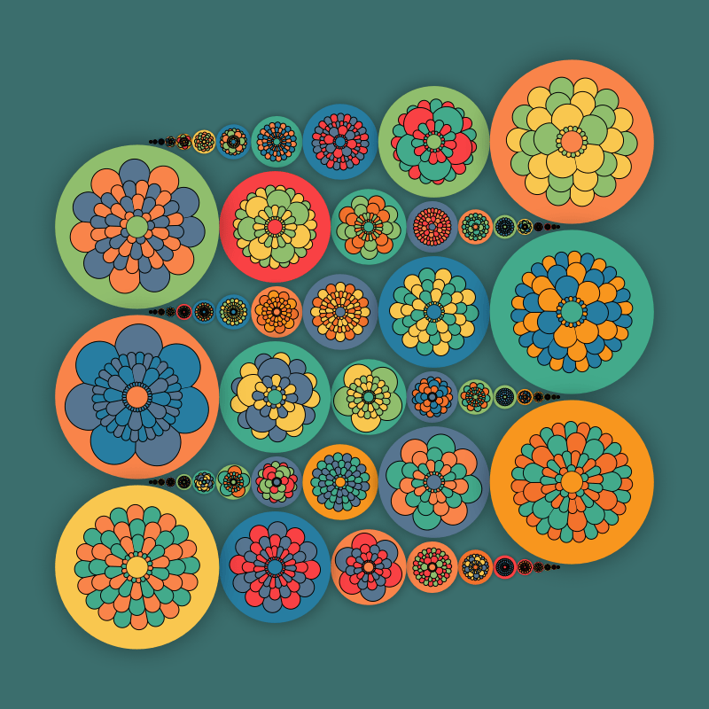 | 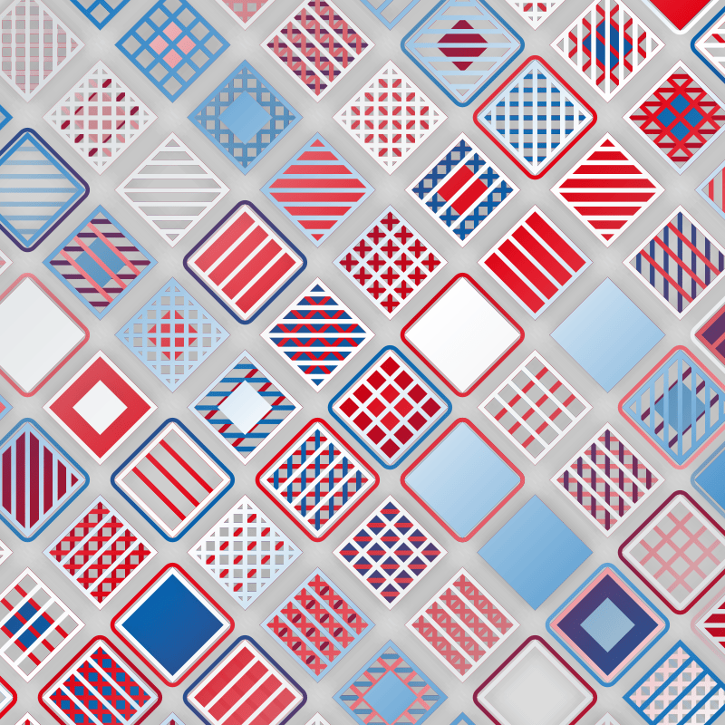 | 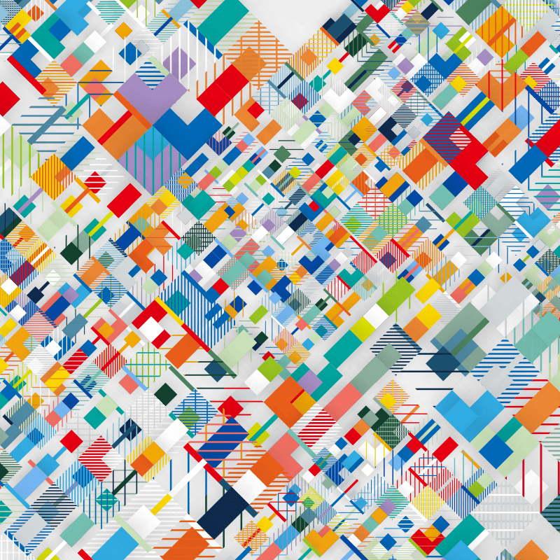 |

| Night house | Path flatten | Priform |
| --- | --- | --- |
| 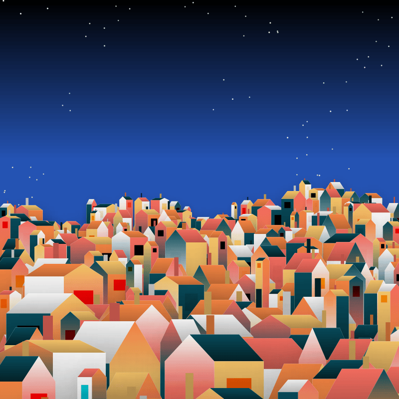 | 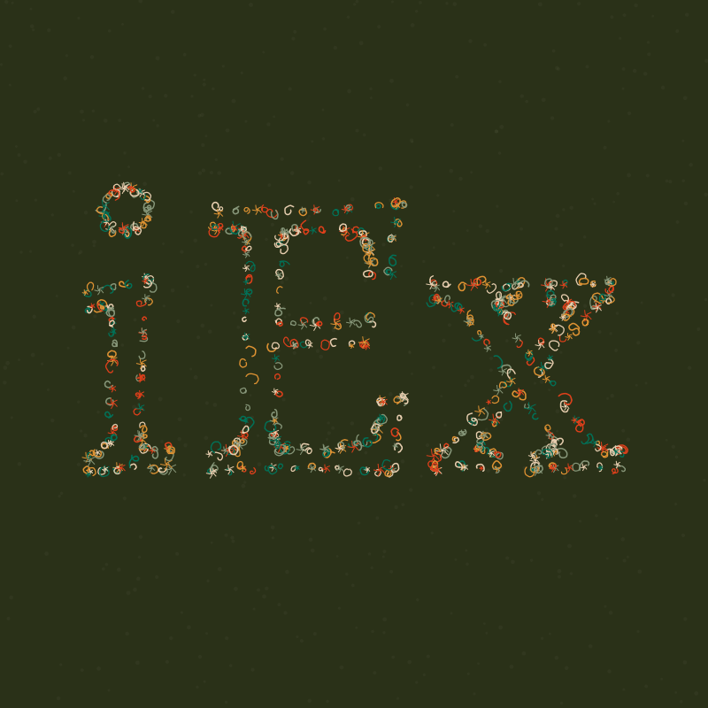 | 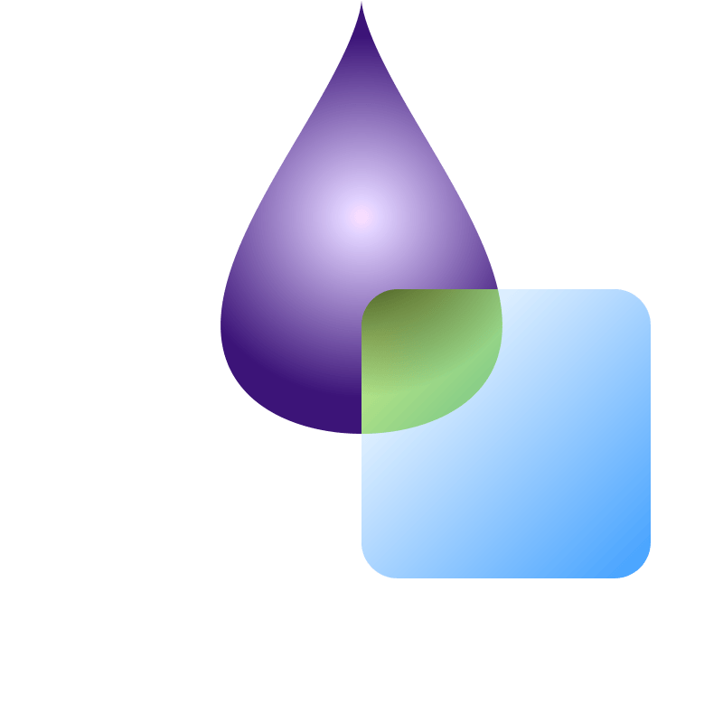 |

| Scale experiments | Table | Watercolor 2 |
| --- | --- | --- |
| 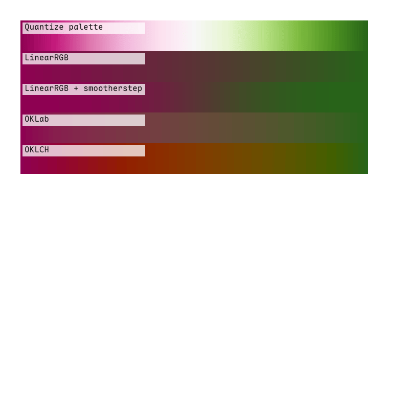 | 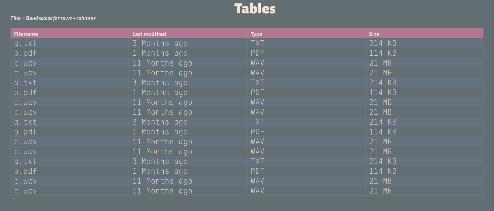 | 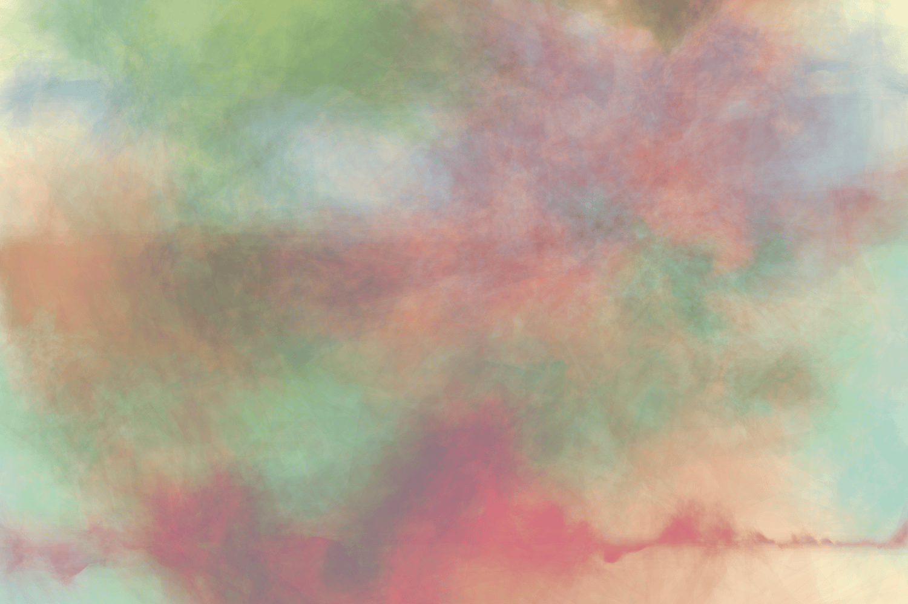 |

To start your Phoenix server:

* Run `mix setup` to install and setup dependencies
* Start Phoenix endpoint with `mix phx.server` or inside IEx with `iex -S mix phx.server`

Now you can visit [`localhost:4000`](http://localhost:4000) from your browser.

## Licenses

- This project is released under the MIT License (see `LICENSE`).
- `blend2d` is licensed under the zlib license.
- The fonts under `priv/fonts/` are distributed under the SIL Open Font License.
- [Chromotome Palettes](https://github.com/kgolid/chromotome) is distributed under MIT License.
- More palettes are imported from (https://github.com/BlakeRMills/MetBrewer) and d3.js.
